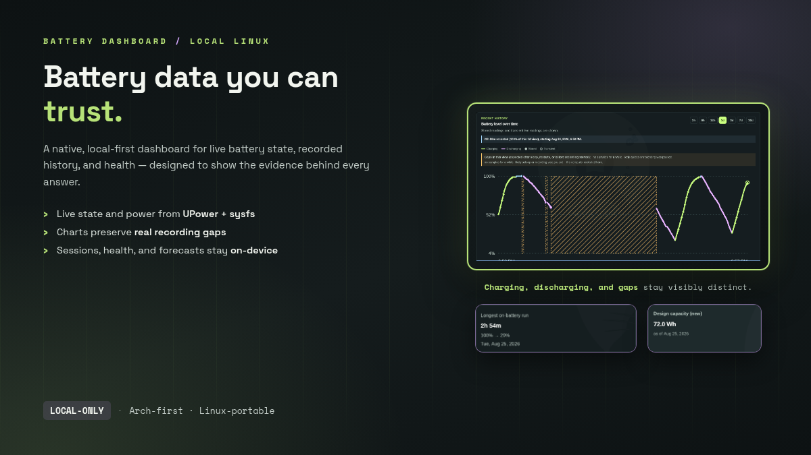

# Battery Dashboard



A local-first native Linux app for understanding laptop battery state and
history. It turns UPower and sysfs data into useful, evidence-based answers
without cloud services, accounts, telemetry, elevated privileges, or a
permanent web server.

**Arch-first, Linux-portable.** Version 1 is being validated on Arch Linux and
its derivatives with a systemd user session. The core does not depend on
Omarchy, Hyprland, GNOME, KDE, or a particular status bar.

## Current status

Battery Dashboard is publicly available as a pre-1.0 release. It has one normal
window, no tray or top-bar icon, and no production HTTP server. It reads every
physical laptop battery exposed by UPower and Linux sysfs, falls back per
metric, and retains each value's source.

The app includes:

- live state, charge, power, voltage, current, temperature, and source details;
- recent charts with real gaps, plus sessions and calendar history;
- health, full/design capacity, hardware-cycle, and conservative degradation views;
- observed today-versus-yesterday usage and evidence-based battery-life/runtime forecasts;
- CSV and JSON export, local anomaly checks, and manual power-profile controls;
- optional local history recording via a one-shot `systemd --user` timer.

Unavailable or weakly evidenced data remains unavailable. The application does
not interpolate suspend, reboot, missing-sample, or battery-change gaps.

The version-1 core is implemented, but release validation, automated
install/update/remove checks, Arch packaging, and broader real-hardware testing
remain. Notifications, per-process impact, and the optional Omarchy plugin are
not implemented. The authoritative status and remaining work are in
[DEVELOPMENT_PLAN.md](DEVELOPMENT_PLAN.md).

## Stack

- Tauri 2 and Rust for the native desktop application and typed IPC;
- Svelte 5, TypeScript, Vite, and Tailwind CSS for the interface;
- UPower and Linux `/sys/class/power_supply` as complementary data sources;
- SQLite for local history;
- a `systemd --user` timer for optional one-shot background recording.

The production app will bundle static frontend assets. Vite is only a
development server; the product will not run an HTTP server after installation.
The desktop app will not create a tray or top-bar icon.

## Repository layout

```text
src/                  Svelte interface and frontend tests
crates/battery-core/  Shared platform-neutral Rust domain types
src-tauri/            Tauri application, recorder, storage, and native tests
systemd/              Opt-in recorder unit templates
packaging/            Desktop-entry source
docs/                 Architecture, privacy, testing, and hardware docs
```

## Install from source

The project requires Rust 1.85 or newer, Node.js 22 or newer, and pnpm 11.
For Arch Linux development, Tauri's official Linux prerequisites currently
list `webkit2gtk-4.1`, `base-devel`, `curl`, `wget`, `file`, `openssl`,
`appmenu-gtk-module`, `libappindicator-gtk3`, `librsvg`, and `xdotool`.
Install system packages with your normal package-management process; this is a
development-machine requirement, not a request for the application to use
`sudo`, `pkexec`, or any privileged helper. See the
[official Tauri prerequisites](https://v2.tauri.app/start/prerequisites/)
for the current package list and non-Arch distribution instructions.

To run the desktop app from a checkout:

```sh
pnpm install
pnpm tauri dev
```

To produce a release bundle:

```sh
pnpm tauri build
```

Vite is only used during development. The installed application loads packaged
assets directly and does not start an HTTP server.

### Local user installation and removal

`pnpm tauri build` builds the release executable. To make a build from this
checkout visible in the application menu for the current user, install its
binary, desktop entry, and icon under user-owned XDG paths. The exact commands
are documented rather than run by the application:

```sh
install -Dm755 target/release/battery-dashboard-desktop ~/.local/bin/battery-dashboard
install -Dm755 target/release/battery-dashboard-recorder \
  ~/.local/bin/battery-dashboard-recorder
install -Dm644 src-tauri/icons/icon.png \
  ~/.local/share/icons/hicolor/512x512/apps/battery-dashboard.png
install -Dm644 packaging/com.gabrielevigano.batterydashboard.desktop \
  ~/.local/share/applications/com.gabrielevigano.batterydashboard.desktop
update-desktop-database ~/.local/share/applications
```

Afterwards, launch **Battery Dashboard** from the application menu or run
`battery-dashboard`. `pnpm tauri dev` also builds the separate recorder binary,
but does **not** enable recording. In Settings, enabling it explicitly stages a
copy below the user's XDG data directory and creates user units below the XDG
config directory; it then uses `systemctl --user` to enable the timer.
Disabling stops future samples and preserves history.

To remove the app files, remove the four files installed above. Disable the
recorder first in Settings or with `systemctl --user disable --now
battery-dashboard-recorder.timer`. The database is deliberately retained until
the user explicitly removes
`${XDG_DATA_HOME:-~/.local/share}/battery-dashboard/battery.sqlite3`; do not
delete it unless intentionally purging local history.

## Development

```sh
pnpm format:check
pnpm lint
pnpm check
pnpm test
pnpm build
cargo fmt --all -- --check
cargo clippy --workspace --all-targets --all-features -- -D warnings
cargo test --workspace
```

## Privacy and background recording

All measurements remain on the local machine. Background recording is disabled
by default and must be explicitly enabled in the desktop Settings screen. It is
managed with `systemctl --user`, not `sudo` or `pkexec`; disabling it preserves
history unless the user explicitly purges it. The recorder is a short-lived
process every 60 seconds, not a daemon or web server.

Read [the privacy policy](docs/privacy.md) and [the architecture overview](docs/architecture.md)
for the intended data flow and boundaries.

## Documentation

- [Product and development plan](DEVELOPMENT_PLAN.md)
- [Architecture](docs/architecture.md)
- [Local data model](docs/data-model.md)
- [Hardware support and limitations](docs/hardware-support.md)
- [Privacy](docs/privacy.md)
- [Testing strategy](docs/testing.md)

## Scope and limitations

- Recording is off by default and stays entirely on the local machine.
- The application never fabricates missing hardware values or estimates.
- UPower estimates can be unavailable or unstable; historical estimates need
  sufficient local evidence before they are shown.
- An optional Omarchy integration may arrive after version 1; the core app
  neither depends on Omarchy nor changes its system files.

## License

This project is licensed under the [MIT License](LICENSE).
